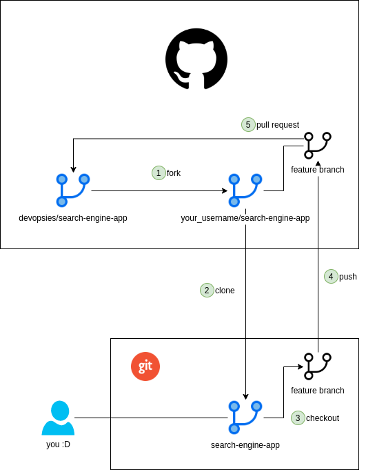

# DevSecOps Workshops: Git & Github

This is a brief introduction to Git, Github, and Github Actions. For the workshop material, visit <a href="https://github.com/devopsies/search-engine-app" target="_blank">github.com/devopsies/search-engine-app</a>.

## What is Git?

Git is a software for tracking changes in any set of files, usually used for coordinating work among programmers collaboratively developing source code during software development. For more information, visit <a href="https://git-scm.com/doc">git-scm.com/doc</a>.

## What is Git?

Github is a provider of Internet hosting for software development and version control using Git. It offers the distributed version control and source code management functionality of Git, plus its own features. For more information, visit <a href="https://docs.github.com/en/github">docs.github.com/en/github</a>.

## What are Github Actions?

GitHub Actions connects all of your tools to automate every step of your development workflow, including and not limited to CI/CD pipelines/jobs. It is hosted on Github (no installation required, as opposed to Jenkins). For more information, visit <a href="https://docs.github.com/en/actions">docs.github.com/en/actions</a>.

## Start using Git, Github & Github Actions

In this workshop, we're going to pretend we're building a product in C++: our awesome search engine. First, `fork` this repository. Forking will create a copy of this repository under you Github account. Then `clone` the repository (the one you created when you forked) to create a local copy of it. When solving any of the following issues, start from your main branch, create and switch to a new local branch `optimizing search` or `optimizing pipeline` depending on the issue you're working on, then `add` and `commit` your changes locally, and finally `push` them to your forked repository on Github. Next, on Github, trigger a pull request (PR) in order to start merging you newly created branch in your forked repository, to our main branch in our original repository.

The following diagram shows the described workflow:

### First issue

You're the developer. The product you're developing (the search engine) currently do not satisfy the requirements as it becomes very slow with a large amount of input. Refer to the issue at <a href="https://github.com/devopsies/search-engine-app/issues/1" target="_blank">github.com/mdnfiras/devsecops-github-actions/issues/1</a> for more details. If you have any question regarding this task, you can leave a comment in that same issue.

### Second issue

You're a DevOps engineer. The CI pipeline you've set up is slow. refer to the issue at <a href="https://github.com/devopsies/search-engine-app/issues/3" target="_blank">github.com/mdnfiras/devsecops-github-actions/issues/3</a> for more details. If you have any question regarding this task, you can leave a comment in that same issue.
